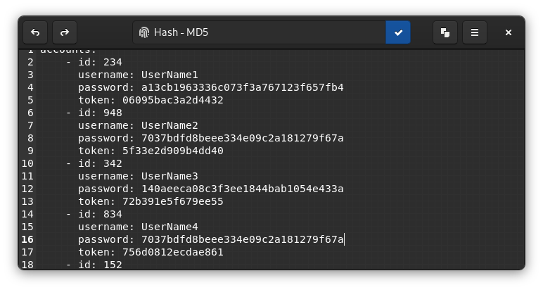

#  Text Pieces

[](https://flathub.org/apps/details/com.github.liferooter.textpieces)



Small tool for quick text transformations such as hashes, encoding, decoding and so on. Written in Vala for GNOME desktop environment in hope to be useful.

# Installation

## From Flathub
> **Recommended**

You can install my app from Flathub <a href="https://flathub.org/apps/details/com.github.liferooter.textpieces">here</a>

## Build from source
### Via GNOME Builder
Text Pieces can be built with GNOME Builder >= 3.38. Just clone this repo and click run button.
### Via Flatpak
Text Pieces has Flatpak manifest, so it can be <a href="https://docs.flatpak.org/en/latest/building-introduction.html">built with Flatpak</a>.
### Via Meson
Text Pieces can be built directly via Meson:
```bash
git clone https://github.com/liferooter/textpieces
cd textpieces
meson build
cd build
ninja
```
Next, it can be installed by `sudo ninja install`.

**Attention! You should NEVER install anything directly with `sudo ninja install` or `sudo make install` because it creates unmanaged files and can break system**

# Dependencies
If you use GNOME Builder or Flatpak, dependencies will be installed automatically. If you use pure Meson, dependencies will be:
- vala >= 0.50
- gtk >= 3.22
- gtksourceview >= 4.8
- gio >= 2.50
- libhandy >= 1.0

# Contributions
Contributions are welcome.
