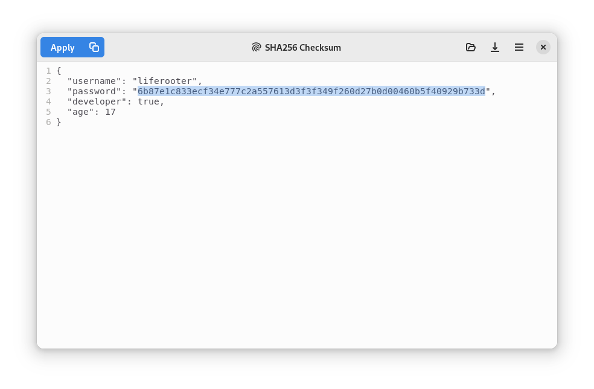

<!--
SPDX-FileCopyrightText: 2021 Gleb Smirnov <glebsmirnov0708@gmail.com>

SPDX-License-Identifier: CC0-1.0
-->

<h1 align="center">
<br/>
Text Pieces
</h1>

<p align="center"><strong>
Swiss knife of text processing
</strong></p>

<br/>

<p align="center">
<a href="https://stopthemingmy.app">
    
</a>
</p>

<p align="center">
<a href="https://flathub.org/apps/details/com.github.liferooter.textpieces">
    
</a>
</p>

<p align="center">
    
</p>


Small tool for quick text transformations such as checksums, encoding, decoding and so on. Written in Vala for GNOME desktop in the hope to be useful.

# Features
- Base64 encoding and decoding
- SHA-1, SHA-2 and MD5 checksums
- Prettify and minify JSON
- Convert JSON to YAML and vice versa
- Count lines, symbols and words
- Escape and unescape string, URL and HTML
- Remove leading and trailing whitespaces
- Sort and reverse sort lines
- Reverse lines and whole text
- Extendable with third-party scripts and custom tools

# Installation

## From Flathub
> **Recommended**

<a href="https://flathub.org/apps/details/com.github.liferooter.textpieces">Click here</a> to install app from Flathub.

## Build from source
### Via GNOME Builder
Text Pieces can be built with GNOME Builder >= 3.38. Clone this repo and click run button.
### Via Flatpak
Text Pieces has a Flatpak manifest to enable it to be <a href="https://docs.flatpak.org/en/latest/building-introduction.html">built with Flatpak</a>.
### Via Meson
Text Pieces can be built directly via Meson:
```bash
git clone https://github.com/liferooter/textpieces
cd textpieces
meson _build
cd _build
meson compile
```
Next, it can be installed by `meson install`.

# Dependencies
If you use GNOME Builder or Flatpak, dependencies will be installed automatically. If you use pure Meson, dependencies will be:
- vala >= 0.52
- gtk >= 4.2
- gtksourceview >= 5.2
- gio >= 2.50
- gee >= 0.8
- json-glib >= 1.6
- libadwaita >= 1.0
- python >= 3.8
- pyyaml >= 5.4

# Contributions
Contributions are welcome.
